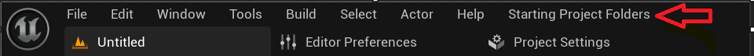

# Starter Project Folder Creation Tool

This is a tool to create the starter files we always create in Unreal Engine, rather than manually creating the folders and naming them this tool does both.

# How to Run

* Open the Output Log Menu, change the bottom left "Cmd" to "Python".
* Copy the code up until the commented out part of the "UnrealStarterFolder.py", found inside the "src" folder, and paste into the textbox next to "Python".
* A new menu will appear in the top part of the Unreal Engine Window named "Starting Project Folders".
* Click on the menu and click on the drop down button named "Create Project Folders".
* _MyFiles folder along with Assets, Blueprints, Levels, and Materials subfolders will be created under "Content" folder.
* The created menu will be gone the next time you open the Unreal Engine Project.